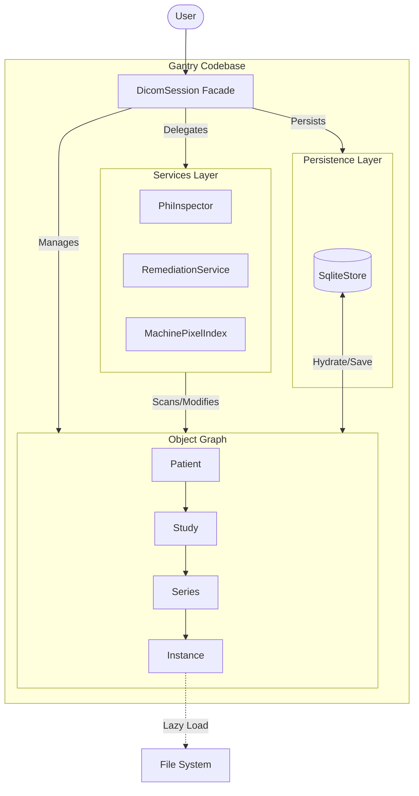

# Gantry

**A Robust, Object-Oriented DICOM Management & Redaction Toolkit.**

[](https://www.python.org/downloads/)
[](https://opensource.org/licenses/MIT)

**Gantry** is a high-level Python library designed to simplify the complexity of DICOM data management. Unlike low-level libraries that treat DICOM files as flat dictionaries of tags, Gantry constructs a **semantic object graph** (`Patient` → `Study` → `Series` → `Instance`).

It features a **Lazy-Loading Proxy** architecture, allowing you to index thousands of files with minimal memory footprint while retaining the ability to modify pixel data on demand.

---

## 🚀 Key Features

### 🛡️ Privacy & Security
*   **Automated PHI Remediation**: Detects and fixes PHI in metadata (Anonymization & Date Shifting).
*   **Reversible Anonymization**: Securely embeds encrypted original identities for authorized recovery (pseudonymization).
*   **Pixel Redaction**: Rules-based engine to redact burned-in PHI from pixel data.
*   **Safe Export**: Just-in-time scanning ensures no "dirty" data is ever written to disk.
*   **Audit Trail**: Logs all sensitive actions to an internal SQLite audit log for compliance.

### ⚡ Performance & Scale
*   **Parallel Processing**: Multi-process architecture for high-speed import and PHI scanning.
*   **Lazy Loading**: Minimal memory footprint; loads pixel data only when needed.
*   **Robust Persistence**: Powered by **SQLite** (`gantry.db`) to handle large-scale datasets with ACID guarantees.
*   **Optimized Batch Operations**: Efficiently processes thousands of files with deferred execution and non-blocking I/O.

### 🧠 Intelligent Data Management
*   **Hierarchical Object Model**: Work with semantic entities (`Patient` → `Study`) instead of raw tags.
*   **Machine-Centric Indexing**: Automatically groups images by equipment signature (Model & Serial).
*   **IOD Validation**: Built-in checks to ensure DICOM standard compliance (Type 1/2 tags).

### 🛠️ Developer Tools
*   **Fluent Builder API**: Programmatically construct valid DICOM datasets for testing.
*   **Comprehensive Logging**: Detailed file-based logs with environment-variable support.

---

## 📦 Installation
Clone the repository and install in editable mode:

```bash
git clone https://github.com/kvnlng/gantry.git
cd gantry
pip install -e .
```

## ⚡ Quick Start: End-to-End Workflow

This guide takes you through a complete de-identification pipeline: **Import → Analyze → Remediate → Export**.

The `gantry.Session` Facade is your primary entry point.

```python
import gantry

# 1. Initialize & Import
# ----------------------
# Loads previous state from 'gantry.db' if it exists.
session = gantry.Session("gantry.db")
session.import_folder("./raw_dicom_data")

# 2. Inventory Check
# ------------------
session.inventory()
# Output:
# Inventory: 3 Devices
#  - GE Revolution (S/N: SN-SCANNER-01)
#  - Siemens Prisma (S/N: SN-SCANNER-02)

# 3. Analyze for PHI (Metadata)
# -----------------------------
# Scans names, IDs, dates, and other identifiers.
findings = session.scan_for_phi()
# Output: Found 5 potential PHI issues.

# (Optional) Persist findings for audit
session.save_analysis(findings)

# 4. Reversible Anonymization (Optional)
# --------------------------------------
# Securely encrypt original identity before anonymizing.
session.enable_reversible_anonymization("gantry.key")
session.preserve_identities(findings)

# 5. Apply Remediation (Metadata Fixes)
# -------------------------------------
# Automatically anonymizes names/IDs and shifts dates based on rules.
session.apply_remediation(findings)

# 6. Redaction (Burned-In Pixels)
# -------------------------------
# A. Generate a config skeleton for your machines
session.scaffold_config("redaction_rules.json")

# B. (User Action) Edit 'redaction_rules.json' to define ROIs
# ...

# C. Apply the Rules
session.load_config("redaction_rules.json")
session.execute_config()

# 7. Safe Export
# --------------
# Exports only clean data. Fails if any PHI remains.
session.export("./clean_dicoms", safe=True)

# 8. Save Session State
# ---------------------
session.save()
```

---

## 💾 Persistence & State Management

Gantry uses a robust SQLite backend (`gantry.db`) to handle large datasets. Persistence is **manual** to give you control over when to write to disk.

```python
# Save your session state to the database
app.save()  # Writes changes in the background
```

You must call `.save()` after operations like `import_folder`, `apply_remediation`, or `execute_config` if you want to keep the changes.


---

## 🕵️ Privacy Inspector

Ensure your data is HIPAA Safe Harbor compliant by scanning for common PHI identifiers directly from your session.

### Basic Scan

```python
# Scan all patients in the session
findings = app.scan_for_phi()
```

### Analyzing Findings

The `findings` object consists of `PhiFinding` records. You can iterate through them or convert them to a Pandas DataFrame for complex analysis.

```python
# 1. Iterate findings
for f in findings:
    print(f"[{f.entity_type}] {f.field_name}: {f.value} ({f.reason})")

# 2. Convert to DataFrame (Requires pandas)
df = findings.to_dataframe()

# Example: Count issues by type
print(df["reason"].value_counts())
# Output:
# Dates are Safe Harbor restricted    120
# Names are PHI                        45
```

### Custom Verification Rules

You can customize which tags are flagged by providing a JSON rule file.

```python
app.scan_for_phi("my_custom_phi_rules.json")
```

---

## 🧩 Architecture

Gantry is modularized into the following components:

| Module | Description |
| :--- | :--- |
Gantry uses a **Layered Architecture** accessed via a central Facade.



### Components

*   **Facade (`gantry.session`)**: The single entry point for all user interactions. It orchestrates the flow components.
*   **Object Graph (`gantry.entities`)**: A hierarchical, in-memory representation of DICOM data (`Patient` → `Study` → `Series` → `Instance`). It uses a **Proxy Pattern** to lazy-load pixel data from disk only when accessed, keeping memory usage low.
*   **Storage (`gantry.persistence`)**: A **SQLite** backend that handles metadata persistence, query optimization, and the **Audit Trail**.
*   **Services (`gantry.services`, `gantry.privacy`)**: encapsulation of business logic (Indexing, Redaction, PHI Scanning, Anonymization).
*   **I/O (`gantry.io_handlers`)**: Low-level wrappers around `pydicom` for robust file reading/writing.

---

## 🧪 Running Tests

Gantry uses `pytest` for comprehensive unit and integration testing.

```bash
# Run the full suite
pytest -v
```

---

## 🗺️ Roadmap

Interested in where Gantry is heading? Check out our [Roadmap](ROADMAP.md).

We welcome contributions! If you'd like to help with any items, please open a Pull Request.

---

## License

This project is licensed under the MIT License - see the LICENSE file for details.
