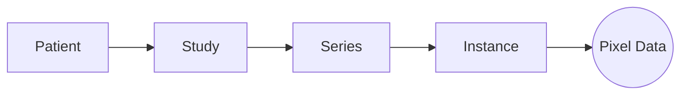

# Gantry

**A Python DICOM Object Model and Redaction Toolkit.**

Gantry provides a high-performance, object-oriented interface for managing, analyzing, and de-identifying DICOM datasets. It is designed for large-scale ingestion, precise pixel redaction, and strict PHI compliance.

## Features

- **Object-Oriented API**: Work with `Patient`, `Study`, `Series`, and `Instance` objects directly.
- **Persistent Sessions**: All metadata is indexed in a SQLite database, allowing you to pause/resume large jobs and providing an audit trail.
- **Parallel Processing**: Multi-process ingestion and export for maximum throughput.
- **Robust Redaction**:
  - **Metadata**: Configurable tag removal, replacement, and shifting.
  - **Pixel Data**: Machine-specific redaction zones (ROI) to scrub burned-in PHI.
  - **Reversibility**: Optional cryptographic identity preservation.
- **Codecs**: Robust support for JPEG Lossless, JPEG 2000, and other compressed formats via `imagecodecs`.
- **Free-threaded Python Ready**: Fully compatible with Python 3.13t+ (no-GIL) for true parallelism.

## Architecture

Gantry acts as a smart indexing layer over your raw DICOM files. It does *not* modify your original data. Instead, it builds a lightweight metadata index (SQLite) and exposes a clean Python Object Model for manipulation.

### 1. The Session Facade
The `Session` object is your single entry point. It manages:
- **Persistence**: Auto-saving state to `gantry.db`.
- **Inventory**: Tracking Patients, Studies, and Series.
- **Transactions**: Atomic persistence of changes.

### 2. Object Model
Gantry abstracts DICOM into a semantic hierarchy, removing the pain of manual tag iteration.



- **Patient**: Root entity (Name, ID).
- **Study**: A distinct visit/exam.
- **Series**: A scan or reconstruction (e.g., "ct_soft_kernel").
- **Instance**: A single DICOM slice. **Pixel data is lazy-loaded**; the 500MB+ pixel array is only read from disk when you access `.pixel_array` or export.

### 3. Pipeline
1.  **Ingest**: Multithreaded scan of input folders. Extracts only essential metadata to SQLite.
2.  **Audit**: Runs rules against the index to flag PHI.
3.  **Clone & Modify**: "Redaction" creates in-memory copies of metadata. Original files are untouched.
4.  **Export**: Writes new, clean DICOM files to the output directory.

## Installation

Gantry requires **Python 3.9+**.

```bash
# Clone the repository
git clone https://github.com/kvnlng/Gantry.git
cd Gantry

# Install with dependencies (including codecs)
pip install -e .
```

*Note: The `imagecodecs` dependency is included and strongly recommended for handling JPEG Lossless and other compressed Transfer Syntaxes.*

## Quick Start

### 1. Initialize a Session

All operations start with a `Session`. This creates (or loads) a local SQLite database to manage your data.

```python
from gantry import Session

# Initialize a new session (creates 'gantry.db' by default)
session = Session("my_project.db")
```

### 2. Ingest Data

Scan directories for DICOM files. Gantry is resilient to nested folders and non-DICOM clutter.

```python
session.ingest("/path/to/dicom/data")
session.save() # Persist the index to disk
```

### 3. Analyze for PHI

Audit your dataset using a configuration file or a built-in profile.

```python
# Create a default configuration file (v2.0 YAML)
session.create_config("config.yaml")

# Run an audit
report = session.audit("config.yaml")
session.save_analysis(report)

print(f"Found {len(report)} potential PHI issues.")
```

### 4. Anonymize & Export

Apply remediation rules (metadata scrubbing + pixel redaction) and export the "clean" data.

```python
# Apply remediation rules in-memory
session.anonymize("config.yaml")

# Export only safe (clean) data to a new folder
# Compression="j2k" optionally compresses output to JPEG 2000
session.export("/path/to/export_clean", safe=True, compression="j2k")
```

Progress for the save, memory release, and export phases will be displayed:

```text
Preparing for export (Auto-Save & Memory Release)...
Releasing Memory: 100%|██████████| 5000/5000 [00:02<00:00, 2000.00img/s]
Memory Cleanup: Released 5000 images from RAM.
Exporting session to output_folder (safe=False)...
Exporting...
Exporting:  15%|██▌       | 15/100 [00:05<00:30,  2.80patient/s]
```

## Configuration

Gantry uses a **Unified YAML Configuration** to control all aspects of de-identification.

### Example `config.yaml`

```yaml

# 1. Privacy Profile (Optional)
# Inherit standard rules from 'basic' or 'comprehensive' profiles.
privacy_profile: "basic"

# 2. Date Jitter
# Shift all dates by a random amount within this range (consistent per Patient).
date_jitter:
  min_days: -30
  max_days: -10

# 3. Private Tags
# Whether to remove all private dicom tags (odd groups).
remove_private_tags: true

# 4. Custom PHI Tags (Overrides Profile)
phi_tags:
  "0010,0010": { "action": "REMOVE", "name": "PatientName" }
  "0010,0020": { "action": "REPLACE", "name": "PatientID", "value": "ANON_{id}" }

# 5. Pixel Redaction Rules (Machine Specific)
machines:
  - serial_number: "DEV12345"
    model_name: "UltraSound Pro"
    redaction_zones:
      - [0, 50, 0, 800] # ROI: [row_start, row_end, col_start, col_end]
```

## Advanced Features

### Pixel Redaction

Gantry can scrub burned-in PHI from pixels based on matching the equipment's `DeviceSerialNumber`. Define `redaction_zones` in your config to automatically verify and scrub these regions during export/anonymization.

### Reversible Anonymization

To maintain a secure link back to the original identity:

```python
# Enable encryption (generates 'gantry.key')
session.enable_reversible_anonymization()

# Lock identities BEFORE anonymization to store encrypted original data
session.lock_identities("PATIENT_123")
```

Users can later recover the identity if they possess the correct key:

```python
session.recover_patient_identity("ANON_123")
```

### Strict Codec & Export Safety

Gantry performs strict validation during export. If a compressed image cannot be decompressed (e.g., due to missing codecs or corruption), the export **will fail** rather than passing through unverified data. This ensures 100% PHI safety.

Supported Transfer Syntaxes:
- JPEG Lossless (Process 14, SV1)
- JPEG 2000 (Lossless & Lossy)
- JPEG-LS
- RLE Lossless
- Standard JPEG Baseline/Extended

## Performance & Benchmarks

Gantry is optimized for high-throughput clinical environments.

| Operation | Scale | Time (Mac M3 Max) | Throughput | 
|-----------|-------|-------------------|------------|
| **Identity Locking** | 100,000 Instances | ~0.13 s | **769k / sec** |
| **Persist Findings** | 100,000 Issues | ~0.13 s | **770k / sec** |
| **Ingestion** | - | - | **25k / sec** |

*Note: Benchmarks run on Python 3.14t (Free-threaded).*

## Migration Tools

### Clinical Trial Processor (CTP)

Gantry includes a utility to convert legacy CTP `DicomPixelAnonymizer.script` files into Gantry's YAML configuration format.

```bash
# Convert CTP script to Gantry YAML
python -m gantry.utils.ctp_parser /path/to/anonymizer.script output_rules.yaml
```

This parser extracts:
- Manufacturer/Model matching criteria.
- Redaction zones (automatically converting `x,y,w,h` to `r1,r2,c1,c2`).

## Running Tests

Gantry uses `pytest` for its test suite.

```bash
pip install -r requirements-dev.txt
pytest
```
