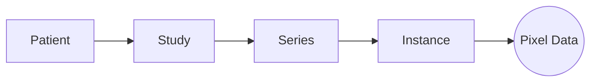
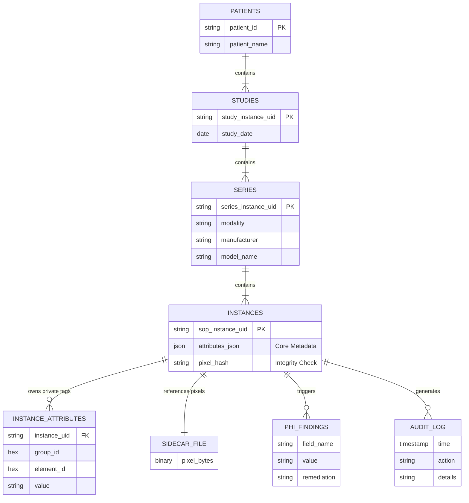

# Architecture

Gantry acts as a smart indexing layer over your raw DICOM files. It does *not* modify your original data. Instead, it builds a lightweight metadata index (SQLite) and exposes a clean Python Object Model for manipulation.

## 1. The Session Facade

The `Session` object is your single entry point. It manages:

- **Persistence**: Auto-saving state to `gantry.db`.
- **Inventory**: Tracking Patients, Studies, and Series.
- **Transactions**: Atomic persistence of changes.

## 2. Object Model

Gantry abstracts DICOM into a semantic hierarchy, removing the pain of manual tag iteration.

- **Patient**: Root entity (Name, ID).
- **Study**: A distinct visit/exam.
- **Series**: A scan or reconstruction (e.g., "ct_soft_kernel").
- **Instance**: A single DICOM slice. **Pixel data is extracted upfront**; the heavyweight pixel array is sequestered in a binary sidecar immediately upon ingestion and loaded into memory only when needed.

## 3. Safety Pipeline (The 8 Checkpoints)

Gantry enforces a strict checkpoint system to ensure data safety:

1. **Ingest**: Load raw data into the managed session index.
2. **Examine**: Inventory the cohort and equipment.
3. **Configure**: Define privacy tags and redaction rules.
4. **Audit (Target)**: Measure PHI risks against the configuration.
5. **Backup**: (Optional) Securely lock original identities for reversibility.
6. **Anonymize**: Apply remediation to metadata (in-memory).
7. **Redact**: Scrub pixel data for specific machines (in-memory).
8. **Verify**: Re-audit the session to ensure a clean state.
9. **Export**: Write clean DICOM files to disk.

## 4. Persistence Architecture (Hybrid Storage)

Gantry uses `sqlite3` for metadata management, employing a **Hybrid Storage Model** to balance query performance with schema flexibility.

### The Problem

DICOM data effectively comes in two shapes:

1. **Standard Tags**: Always present, well-defined (e.g., `Modality`, `StudyDate`).
2. **Private Tags**: Manufacturer-specific, sparse, and extremely numerous.

Storing everything in a single table with 3000 columns is impossible. Storing everything in a vertical Entity-Attribute-Value (EAV) table is too slow for bulk loading.

### The Solution: Core JSON + Vertical Split

Values are automatically split during persistence based on their Group ID:

| Storage Location | Table | Column | Content | Rationale |
| :--- | :--- | :--- | :--- | :--- |
| **Core Attributes** | `instances` | `attributes_json` | All Standard Tags (Even Groups) + Binary Placeholders | **Speed**. SQLite's JSONB operators allow us to load 10,000 instances in sub-second time without performing 10,000+ joins. |
| **Vertical Attributes** | `instance_attributes` | `tag_group`, `tag_elem`, `value` | Private Tags (Odd Groups) | **Flexibility**. Private tags are sparse. This EAV storage prevents the Core JSON from becoming bloated with garbage data while keeping private tags queryable. |
| **Pixel Data** | `[name]_pixels.bin` | Comparison to DB via Offset/Length | Raw Byte Stream | **Offloading**. Gigabytes of pixel data are kept out of the DB to prevent bloating and ensure the index remains lightweight. |

### Database Schema Reference

| Table | Purpose | Key Columns |
| :--- | :--- | :--- |
| `patients` | Root entity. | `patient_id` (PK), `patient_name` |
| `studies` | Represents a patient visit. | `study_instance_uid` (PK), `study_date`, `patient_id_fk` |
| `series` | Represents a scan/sequence. | `series_instance_uid` (PK), `modality`, `manufacturer`, `model_name`, `device_serial_number`, `study_id_fk` |
| `instances` | Represents a single DICOM file. | `sop_instance_uid` (PK), `attributes_json`, `pixel_hash`, `file_path`, `series_id_fk` |
| `instance_attributes` | Storage for Private/Odd Group tags. | `instance_uid` (FK), `group_id`, `element_id`, `value` |
| `audit_log` | Logs all modification actions. | `timestamp`, `action_type`, `entity_uid`, `details` |
| `phi_findings` | Stores potential PHI detected during audit. | `entity_uid`, `field_name`, `value`, `remediation_action` |

### Schema Visualization

