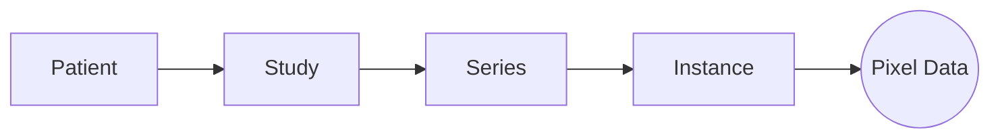

# Architecture

Gantry acts as a smart indexing layer over your raw DICOM files. It does *not* modify your original data. Instead, it builds a lightweight metadata index (SQLite) and exposes a clean Python Object Model for manipulation.

## 1. The Session Facade

The `Session` object is your single entry point. It manages:

- **Persistence**: Auto-saving state to `gantry.db`.
- **Inventory**: Tracking Patients, Studies, and Series.
- **Transactions**: Atomic persistence of changes.

## 2. Object Model

Gantry abstracts DICOM into a semantic hierarchy, removing the pain of manual tag iteration.

- **Patient**: Root entity (Name, ID).
- **Study**: A distinct visit/exam.
- **Series**: A scan or reconstruction (e.g., "ct_soft_kernel").
- **Instance**: A single DICOM slice. **Pixel data is lazy-loaded**; the 500MB+ pixel array is only read from disk when you access `.pixel_array` or export.

## 3. Safety Pipeline (The 8 Checkpoints)

Gantry enforces a strict checkpoint system to ensure data safety:

1. **Ingest**: Load raw data into the managed session index.
2. **Examine**: Inventory the cohort and equipment.
3. **Configure**: Define privacy tags and redaction rules.
4. **Audit (Target)**: Measure PHI risks against the configuration.
5. **Backup**: (Optional) Securely lock original identities for reversibility.
6. **Anonymize**: Apply remediation to metadata (in-memory).
7. **Redact**: Scrub pixel data for specific machines (in-memory).
8. **Verify**: Re-audit the session to ensure a clean state.
9. **Export**: Write clean DICOM files to disk.
