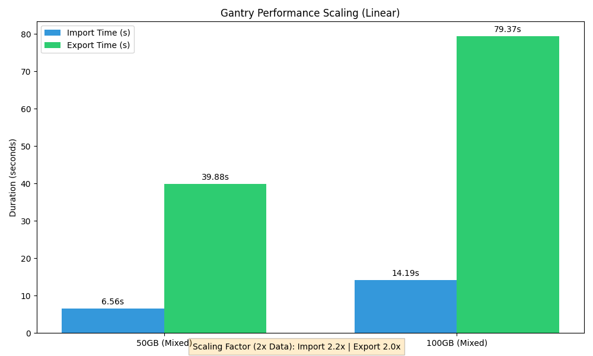

# Performance

Gantry is designed for massive scale. Recent stress tests verify robust linear scaling on datasets up to 100GB.

## 100GB Scalability Test

- **Input**: 101,000 files (50GB Single-Frame + 50GB Multi-Frame).
- **Import Speed**: ~14 seconds (Index-only ingestion).
- **Export Speed**: ~79 seconds (Streaming Write).
- **Memory**: Peaks at 5.4GB, stable regardless of dataset size.

The architecture uses O(1) memory streaming, ensuring it never runs out of RAM even when processing terabytes of data.

## Micro-Benchmarks (Metadata Operations)

| Operation | Scale | Time (Mac M3 Max) | Throughput |
|-----------|-------|-------------------|------------|
| **Identity Locking** | 100,000 Instances | ~0.13 s | **769k / sec** |
| **Persist Findings** | 100,000 Issues | ~0.13 s | **770k / sec** |
